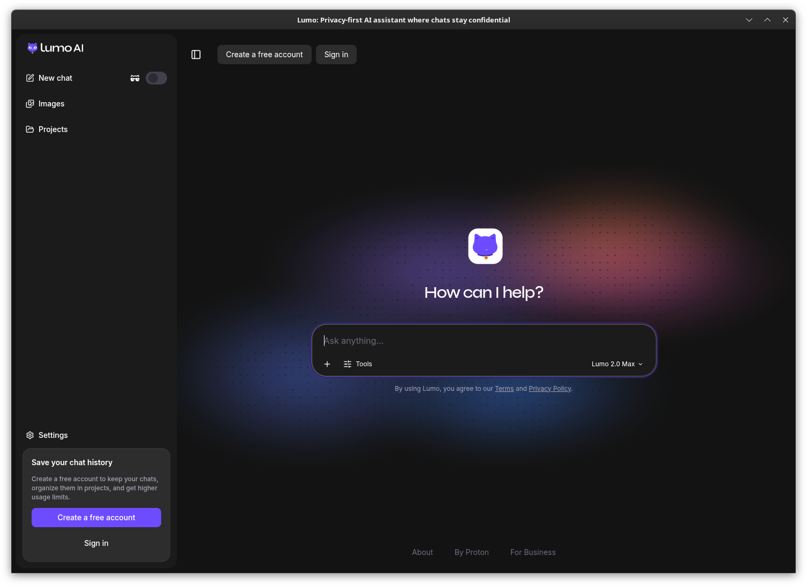
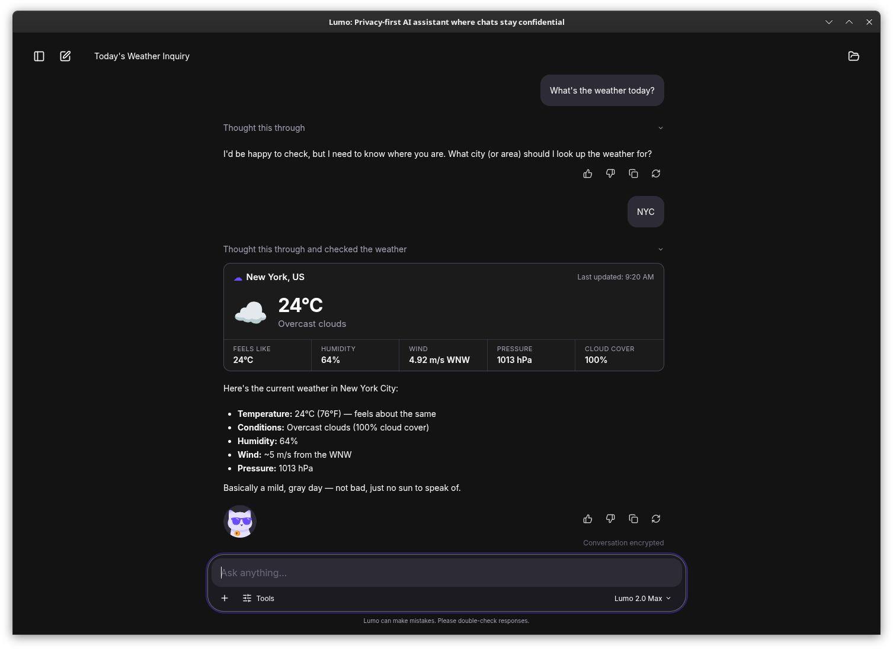
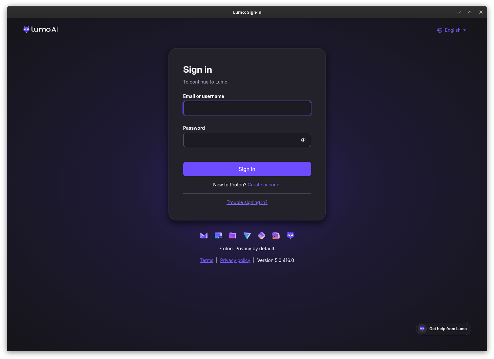
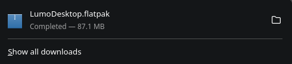
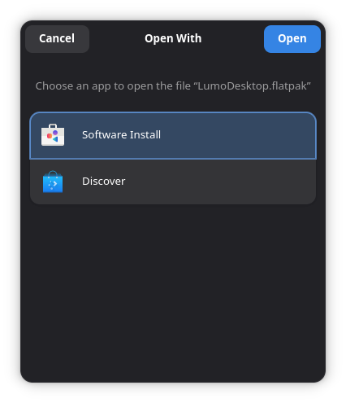
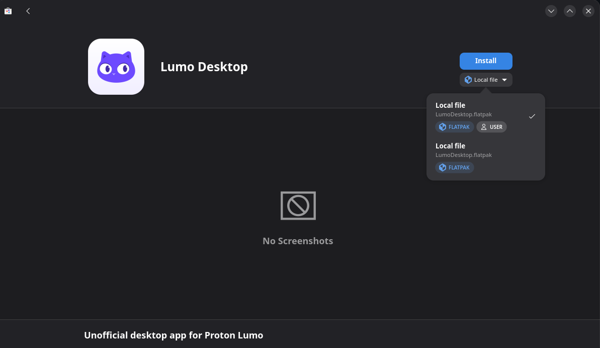

# Lumo Desktop

An unofficial Linux desktop wrapper around [Proton's Lumo web app](https://lumo.proton.me), packaged as a single Flatpak that runs on any distro.


> **Unofficial.** This project is not affiliated with, endorsed by, or supported by Proton AG.
> "Lumo" and "Proton" are trademarks of Proton AG, used here only to describe what the app
> connects to. The app loads Proton's web app unmodified — no reimplementation, no scraping. The
> app icon is Proton's own Lumo mascot artwork, reproduced from lumo.proton.me so the app is
> recognisable next to the web app, and it remains Proton AG's property. If Proton asks, this
> project will rename and change its icon.



<details>
<summary>More screenshots</summary>





</details>

## Contents

- [What it is](#what-it-is)
- [Features](#features)
- [Install](#install)
  - [From a release](#from-a-release)
  - [From source](#from-source)
- [Uninstall](#uninstall)
- [Usage](#usage)
  - [Show/Hide toggle](#showhide-toggle)
  - [Tray icon](#tray-icon)
  - [Keyboard shortcuts](#keyboard-shortcuts)
  - [Where links open](#where-links-open)
- [Privacy & security](#privacy--security)
- [Updating](#updating)
- [Troubleshooting / FAQ](#troubleshooting--faq)
- [Development](#development)
  - [Repo layout](#repo-layout)
  - [Design rules for contributors](#design-rules-for-contributors)
  - [Releasing](#releasing)
- [Status & limitations](#status--limitations)
- [Contributing](#contributing)
- [License](#license)
- [Acknowledgements](#acknowledgements)

## What it is

Lumo Desktop is a thin Electron shell around `lumo.proton.me`. It doesn't reimplement Lumo's API
or protocol, and it doesn't touch login, 2FA, or encryption — Proton's own unmodified web code
handles all of that, running inside the wrapper exactly as it would in a browser tab. What the
wrapper adds is native desktop integration: a window, a tray icon, keyboard shortcuts, spellcheck,
notifications, and portal-based file dialogs, packaged once as a Flatpak so it runs the same way
on any Linux distro instead of chasing per-distro builds.

## Features

- System tray icon with a quick show/hide toggle.
- Show/Hide from anywhere via `flatpak run io.github.davethegamedev.LumoDesktop --toggle`, bindable to a global keyboard shortcut.
- Native desktop notifications.
- Spellcheck with right-click suggestions (Electron's built-in spellchecker).
- Portal-based file dialogs — uploads and downloads go through the XDG desktop portals, not broad filesystem access.
- Wayland native, with an X11 fallback.
- A handful of keyboard shortcuts for navigation and zoom (see [Usage](#usage)).
- Links to other websites, and to `proton.me` pages other than Lumo/account, open in your default browser instead of inside the app window.
- No telemetry, no crash reporting, no update checks.

## Install

### From a release

Download `LumoDesktop.flatpak` from the
[GitHub Releases page](https://github.com/DaveTheGameDev/lumo-desktop/releases), then install it
either way below. The runtime (`org.freedesktop.Platform//25.08`) and
`org.electronjs.Electron2.BaseApp` are pulled from Flathub automatically, so the Flathub remote
has to be configured first. Most distributions ship it enabled; if not, add it with:

```sh
flatpak remote-add --if-not-exists flathub https://dl.flathub.org/repo/flathub.flatpakrepo
```

#### With your distribution's software centre

If your desktop has a software installer that handles Flatpak (GNOME Software on Fedora and
Ubuntu, Discover on KDE, and others), open the downloaded `LumoDesktop.flatpak` with it, for
example by clicking it in your browser's downloads list or double-clicking the file:



If asked which app to open it with, pick your software centre (here "Software Install", which is
GNOME Software):



Then press **Install**. If the installer offers a choice between a plain install and one marked
**User**, pick **User**. It installs for your account only, needs no administrator password, and
matches everything else in this README.



#### From the command line

```sh
flatpak install --user LumoDesktop.flatpak
```

#### Launching

Start it from your app grid ("Lumo Desktop") or with:

```sh
flatpak run io.github.davethegamedev.LumoDesktop
```

### From source

Prerequisites:

- Node.js >= 22
- Flatpak, with the build tools installed:
  ```sh
  flatpak install --user flathub org.electronjs.Electron2.BaseApp//25.08 org.flatpak.Builder
  ```

Build everything (packages the Electron app, then builds and installs the Flatpak):

```sh
scripts/build-flatpak.sh
```

This produces `LumoDesktop.flatpak` in the repo root and also installs the app to your user
Flatpak install. Pass `--no-bundle` to build and install locally without producing the `.flatpak`
bundle file.

## Uninstall

Remove the app, keeping your login and settings in case you reinstall later:

```sh
flatpak uninstall --user io.github.davethegamedev.LumoDesktop
```

Or use your software centre: find "Lumo Desktop" in its installed apps and press **Uninstall**.

To also delete the browser profile (cookies, session, window state), run this instead:

```sh
flatpak uninstall --user --delete-data io.github.davethegamedev.LumoDesktop
```

Then clean up anything left behind:

- Any `flatpak override` you set for the app (from [Privacy & security](#privacy--security) or
  [Troubleshooting](#troubleshooting--faq)):
  ```sh
  flatpak override --user --reset io.github.davethegamedev.LumoDesktop
  ```
- The keyboard shortcut for the `--toggle` command, if you added one in GNOME or KDE settings.
- The shared runtime and Electron base app, if nothing else uses them:
  ```sh
  flatpak uninstall --user --unused
  ```

If you ran the app from source with `npm start`, its profile lives at `~/.config/Lumo Desktop/`
and is not touched by any of the above; delete it by hand.

## Usage

### Show/Hide toggle

Bring the window to the front (or hide it) from anywhere, without clicking the tray icon:

```sh
flatpak run io.github.davethegamedev.LumoDesktop --toggle
```

Bind this to a keyboard shortcut:

- **GNOME:** Settings → Keyboard → View and Customize Shortcuts → Custom Shortcuts → Add Shortcut, using the command above.
- **KDE Plasma:** System Settings → Keyboard → Shortcuts → Add New → Command or Script, using the command above.

### Tray icon

Vanilla GNOME Shell doesn't render `StatusNotifierItem` tray icons without the
[AppIndicator and KStatusNotifierItem Support extension](https://extensions.gnome.org/extension/615/appindicator-support/).
The app is fully usable without a tray icon — use the `--toggle` command above, or relaunch it.

### Keyboard shortcuts

| Shortcut | Action |
|---|---|
| Ctrl+Q | Quit |
| Ctrl+W | Close to tray |
| Ctrl+R | Reload |
| Alt+Left / Alt+Right | Back / forward |
| Ctrl+Shift+H | Back to Lumo home |
| Ctrl+Plus / Ctrl+Minus / Ctrl+0 | Zoom in / out / reset |
| Alt | Show the menu bar |
| Ctrl+Shift+L | Global show/hide (X11 only — see [Troubleshooting](#troubleshooting--faq)) |

### Where links open

Only `lumo.proton.me` and `account.proton.me` can take over the app window. Popups that Proton's
pages open with `window.open()` (for example during sign-in) get their own sandboxed child window
as long as they stay on `proton.me`. Every other `proton.me` page, and any external link, opens in
your system's default browser instead.

## Privacy & security

- The renderer runs with `contextIsolation` on, `sandbox` on, and `nodeIntegration` off. The
  preload script exposes nothing to the page, and there is no IPC between the page and the main
  process.
- The main process never reads cookies, intercepts requests, injects scripts into the page, or
  overrides certificates. It only handles window/tray/shortcut plumbing and a navigation allowlist.
- Login, 2FA, SRP, and end-to-end encryption are entirely Proton's unmodified web code — this
  wrapper never touches credentials or cryptographic material.

Flatpak sandbox permissions and why each is needed:

| Permission | Why |
|---|---|
| `--share=ipc` | X11 shared memory (MIT-SHM); needed for acceptable rendering performance under X11 |
| `--share=network` | Reach `lumo.proton.me` / `account.proton.me` and download spellcheck dictionaries |
| `--socket=wayland` | Native Wayland windowing |
| `--socket=fallback-x11` | X11 fallback for non-Wayland sessions |
| `--device=dri` | GPU acceleration for rendering |
| `--socket=pulseaudio` | Audio and microphone, so Lumo's voice input can work |
| `--talk-name=org.freedesktop.Notifications` | Native desktop notifications |
| `--talk-name=org.kde.StatusNotifierWatcher` | System tray icon (StatusNotifierItem protocol) |
| `--env=XCURSOR_PATH=…` | Cosmetic — correct cursor theme inside the sandbox instead of the X11 default |

Deliberately absent: no `--filesystem` permission (file uploads/downloads go through the XDG
portals instead of direct filesystem access), and no access to the keyring
(`org.freedesktop.secrets`) — the Secret Service API has no per-app isolation, so granting it
would expose your entire keyring to the app for very little gain (see [SECURITY.md](SECURITY.md)).

**Data location:** the browser profile (cookies, session, window state) lives at
`~/.var/app/io.github.davethegamedev.LumoDesktop/config/Lumo Desktop/` when running as a Flatpak,
or `~/.config/Lumo Desktop/` when run via `npm start`. Deleting that directory logs you out and
resets the app.

**Cookies are stored in plaintext** by Chromium, because the keyring is not reachable inside the
sandbox. Rely on full-disk encryption to protect them at rest.

**Spellcheck dictionaries** download from Google's CDN the first time each language is used, which
reveals your IP address and locale to Google. Typed text itself stays local and is never sent
anywhere except to Lumo/Proton as part of your conversation.

**No telemetry, no crash reporting, and no update checks** are performed by the wrapper itself.

To revoke audio/microphone access on an installed app without rebuilding:

```sh
flatpak override --user --nosocket=pulseaudio io.github.davethegamedev.LumoDesktop
```

Undo with:

```sh
flatpak override --user --socket=pulseaudio io.github.davethegamedev.LumoDesktop
```

See [SECURITY.md](SECURITY.md) for the full security model and how to report a vulnerability.

## Updating

The app has no auto-update mechanism and is not on Flathub, so updates are not offered by
`flatpak update` or your software centre. New versions are published on this project's
[GitHub Releases page](https://github.com/DaveTheGameDev/lumo-desktop/releases); use the
**Watch → Custom → Releases** option on the repository to get notified about them.

To update, download the new `LumoDesktop.flatpak` and install it the same way as the first time
(see [Install](#install)):

```sh
flatpak install --user LumoDesktop.flatpak
```

This replaces the installed version in place. Your login, settings, and any `flatpak override`
you set are kept. Quit the app first (Ctrl+Q, or from the tray icon) so the new version is used
on the next launch.

Updating matters for security: the app bundles Electron, which bundles Chromium, and neither is
updated by anything other than a new release of Lumo Desktop. If you build from source, bump the
`electron` version in `package.json` and rebuild with `scripts/build-flatpak.sh` to pick up
Chromium fixes yourself.

## Troubleshooting / FAQ

**No tray icon on GNOME.** Install the
[AppIndicator and KStatusNotifierItem Support extension](https://extensions.gnome.org/extension/615/appindicator-support/),
or just use the `--toggle` command / relaunch the app — the tray icon is not required.

**"Can't reach Lumo."** The window shows this page with a Retry link when Lumo can't be reached.
Check your network connection and retry.

**The window won't come back after closing.** Closing the window (the X button or Ctrl+W) hides it rather than quitting. Run
`flatpak run io.github.davethegamedev.LumoDesktop --toggle`, or relaunch the app.

**The global shortcut (Ctrl+Shift+L) doesn't do anything.** Electron's `globalShortcut` only works
reliably on X11. Under Wayland, use the `--toggle` command with a compositor-level custom shortcut
instead (see [Usage](#usage)).

**The window buttons (minimise / maximise / close) are barely visible, or the title bar doesn't
match my GTK theme.** GNOME's Wayland compositor doesn't draw window frames, so Chromium draws the
title bar itself from the GTK theme inside the sandbox — and some themes get their
Chromium-specific rules wrong (Breeze's dark variant, for one, paints dark buttons on a dark bar).
The launcher therefore pins the frame to GTK's built-in Adwaita theme, light or dark following
your system colour scheme at launch; switching light/dark while the app is running takes effect
after a relaunch. To use your own theme anyway:

```sh
flatpak override --user --env=GTK_THEME=Breeze:dark io.github.davethegamedev.LumoDesktop
```

Undo with `flatpak override --user --unset-env=GTK_THEME io.github.davethegamedev.LumoDesktop`.
When running from source with `npm start`, the pin isn't applied — set `GTK_THEME=Adwaita:dark`
(or `Adwaita`) in the environment yourself if you hit the same problem.

**I want to fully reset the app.** Delete the profile directory (see
[Privacy & security](#privacy--security) for the path). This logs you out and clears all local
state.

**Login trouble.** The login page is Proton's own code, unmodified by this wrapper. If you're
having trouble signing in, first try logging in to [lumo.proton.me](https://lumo.proton.me) in a
regular browser to rule out an account-side issue.

**"Unsupported browser" wall.** If Proton ever shows this, please
[open an issue](https://github.com/DaveTheGameDev/lumo-desktop/issues) — there's a user-agent
override in `src/main.js` that can be enabled to work around it.

## Development

```sh
npm install
npm start
```

Enable debug logging with:

```sh
LUMO_DESKTOP_DEBUG=1 npm start
```

### Repo layout

- `src/main.js` — Electron main process: window, tray, shortcuts, navigation allowlist.
- `src/preload.js` — deliberately empty preload script; see the comment at the top for why.
- `flatpak/` — the Flatpak manifest, desktop entry, and metainfo.
- `scripts/` — build tooling (`build-flatpak.sh`).
- `docs/RESEARCH.md` — research notes from before this project started.

### Design rules for contributors

- No preload bridge / `contextBridge` API. The renderer gets nothing from Node or Electron; keep
  it that way.
- The navigation allowlist (only `lumo.proton.me` and `account.proton.me` render in-window; other
  links open externally) stays as-is.
- Don't add new sandbox permissions unless there's no portal-based way to do it. Prefer XDG
  portals over `--filesystem` or other broad grants.

### Releasing

1. Bump `version` in `package.json` and add a matching `<release>` entry to
   `flatpak/io.github.davethegamedev.LumoDesktop.metainfo.xml`.
2. Run `scripts/build-flatpak.sh` to produce `LumoDesktop.flatpak`.
3. Create the release:
   ```sh
   gh release create vX.Y.Z LumoDesktop.flatpak --generate-notes
   ```
4. Publish the checksum in the release notes:
   ```sh
   sha256sum LumoDesktop.flatpak
   ```

## Status & limitations

- Version 0.1.x — early days, tested on Fedora / GNOME Wayland only so far. Reports from other
  distributions and desktops are welcome.
- Not on Flathub, and not planned unless the app is renamed — Flathub's naming/branding policy
  doesn't allow a Proton-derived name for a third-party wrapper like this.
- No auto-update mechanism.
- Tray icon requires a GNOME extension (see [Usage](#usage)).
- The global keyboard shortcut only works on X11; use the `--toggle` command under Wayland.
- The window frame (title bar and its buttons) always uses GTK's Adwaita theme, in the light or
  dark variant picked at launch — see [Troubleshooting](#troubleshooting--faq).

## Contributing

Issues and pull requests are welcome. Please keep the wrapper thin (see
[Design rules for contributors](#design-rules-for-contributors) above), and test changes both with
`npm start` and with a full Flatpak build (`scripts/build-flatpak.sh`).

## License

GPL-3.0-or-later. Copyright (C) 2026 DaveTheGameDev. See [LICENSE](LICENSE) for the full text.
Electron and Chromium ship their own licenses inside the bundle.

The app icon (`assets/icon.svg` and `assets/icon.png`) is Proton AG's Lumo mascot artwork,
reproduced from the SVG favicon served by lumo.proton.me. It is Proton's property and is **not**
covered by the GPL. Anyone forking this project for something other than a Lumo client should
replace it.

## Acknowledgements

- [Proton](https://proton.me) for Lumo, the web app this project wraps, and for the Lumo mascot artwork used as the app icon.
- [Electron](https://www.electronjs.org/).
- [Flathub](https://flathub.org)'s Electron2 BaseApp and [zypak](https://github.com/refi64/zypak), which make sandboxed Electron on Flatpak possible.
- [kenvandine/proton-lumo-ai](https://github.com/kenvandine/proton-lumo-ai), studied as prior art (a Snap-based Electron wrapper); no code was copied.
